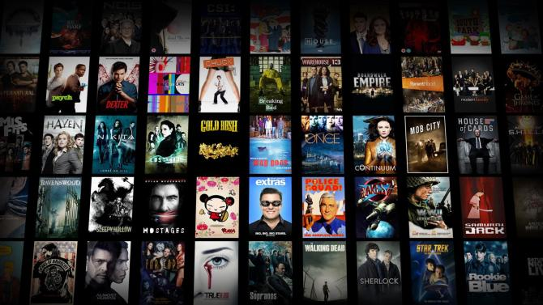
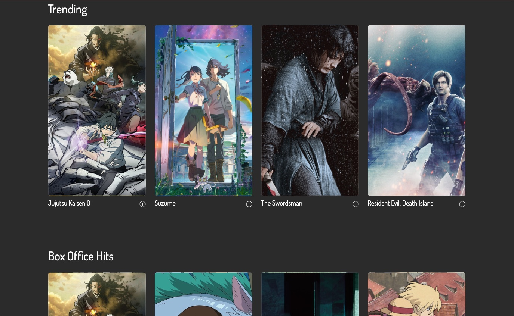
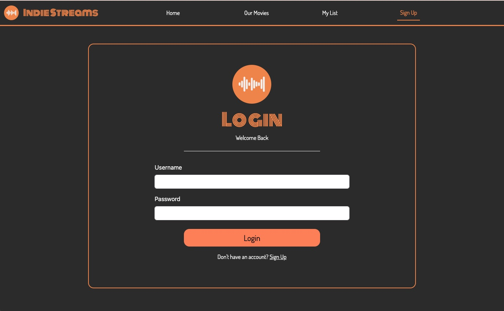
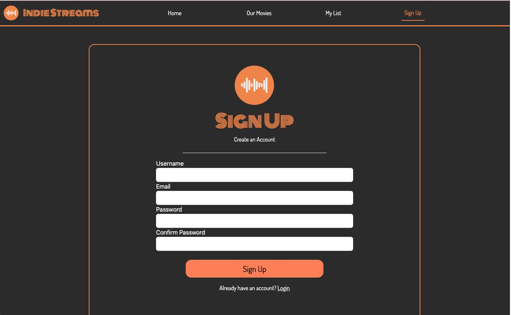

# DV100T4_GroupProject

## INDIE STREAMS

Presentation Slides https://docs.google.com/presentation/d/1dSVckKAeGkG0Dg8pe44Cmkat5KV-at1TIUuMWN9uS4M/edit?pli=1#slide=id.g297093e9947_0_9

### Table of Contents
* About the project
* Home Page
* Library Page
* Playlist Page
* Login Page
* Sign Up Page
* Built With
* Members of the project

### About the project
The task was to create a streaming platform with content loading in dynamically as well as adding features like the "add to playlist" and "sort"
This is a streaming platform for anyone and everyone to watch movies and shows on. This is exclusively non Hollywood movies. 

### Home Page

On the Home Page you are greeted with a slider with more than just the image below.

As you scroll down you'll find different categories available. 

### Library Page
On the library page we have different Indie movies available which are all loaded in using an API...With the power to play the movie on that page.

### Playlist Page 

### Login Page
Both the Login and Sign Up page are similar in design plus effective and efficient 

### Sign UP page

### Built With
* [Javascript]()
* [Jquery]()
* [Bootstrap](https://getbootstrap.com/docs/5.3/getting-started/introduction/)
* [API](https://developer.themoviedb.org/reference/intro/getting-started)

### Members of the group project
     Kurt S
     James S
     Loraynne VT
     Masego M

### Video
[Uploading ClipChamp.zip…]()
